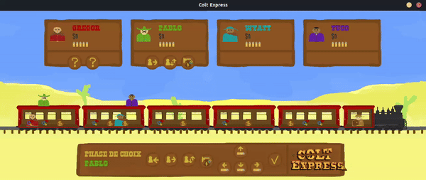
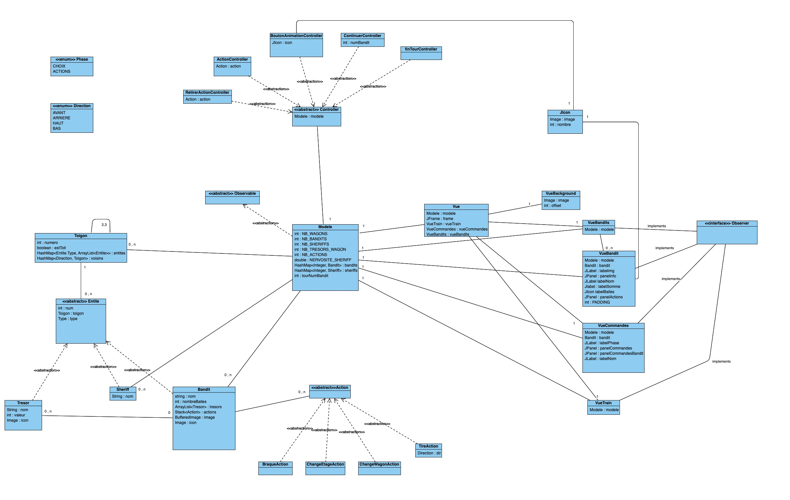

# Colt Express

> Finir est souvent bien plus difficile que commencer.
— Jack Beauregard

## Sommaire

- [Introduction](#introduction)
- [Parties traitées](#parties-traitées)
- [Difficultés](#difficultes)
- [Diagramme UML](#diagramme-uml)
- [Utilisation](#utilisation)

## Introduction
Projet de POGL pour l'année 2023-2024 sur le jeu de société [Colt Express](https://www.ludonaute.fr/en/product/colt-express/)
réalisé par:
- Aymeric Emond <aymeric.emond@universite-paris-saclay.fr>
- Tristan Hartmann-Baudry  <tristan.hartmann-baudry@universite-paris-saclay.fr>

## Parties traitées

## Difficultés

## Diagramme UML

## Utilisation
Pour jouer au jeu, vous pouvez soit compilés les sources du projet par
vous même, ou alors lancer avec java le fichier [ColtExpress.jar](ColtExpress.jar).